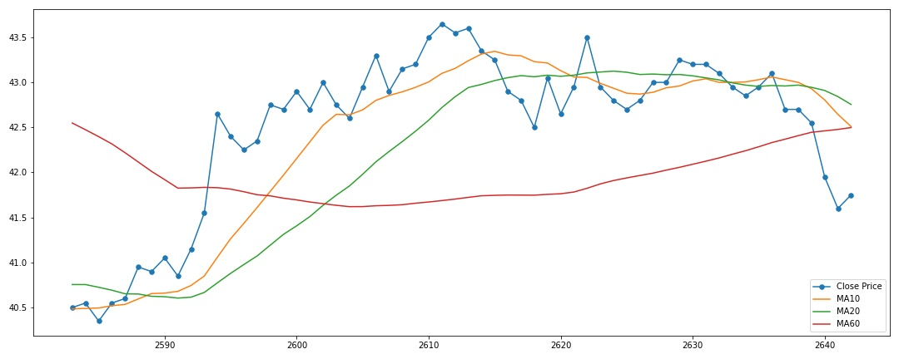
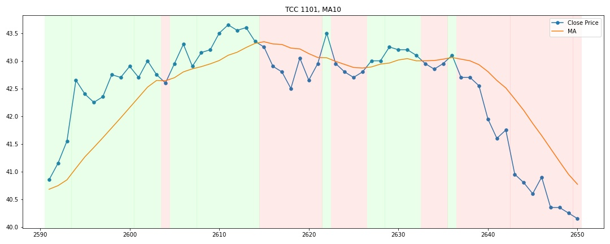

# Taiwan Market Breadth

The code for crawling, updating and cleaning data for visualizing Taiwan market breadth 

## `crawler`

- `company_list.py`
    
    For obtaining the information of all companies listed in TWSE market.
    The result would contains columns: `symbol`, `name`, `isin_code`, `date`, `category`, `cfi_code`

- `crawler.py`

    Use the result obtained from `company_list.py` to crawl the trading history of each company.
    The result would contains columns: `date`, `vol`, `val`, `open`, `high`, `low`, `close`, `change`, `transaction`

## `market_breadth`

- `market_breadth.py`
    
    Calculate the market breadth for each industry category and record the detail information.
    The result is in JSON for example:
    ```json
    {
        "category 1": {
            "summary": {
                "ma5": 14.285714285714285,
                "ma10": 28.57142857142857,
                "ma20": 42.857142857142854,
                "ma60": 85.71428571428571,
                "ma5_count": 947,
                "ma10_count": 945,
                "ma20_count": 940,
                "ma60_count": 940
            },
            "detail": [
                {
                    "symbol": 1101,
                    "name": "ch name 1",
                    "en_name": "eng name 1",
                    "close_price": 42.85,
                    "change": -0.1,
                    "ma5": 43.06,
                    "ma10": 43.00500000000003,
                    "ma20": 42.970000000000006,
                    "ma60": 42.24083333333338
                }
            ]
        }
    }
    ```

## The Moving Average Visualization





> Green highlight means that the close price is greater than the value of moving average, whereas red does not

## TODO

- bash script for updating history trading data

- update `README.md`

- crawl index info
